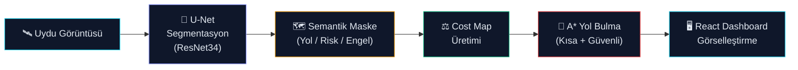
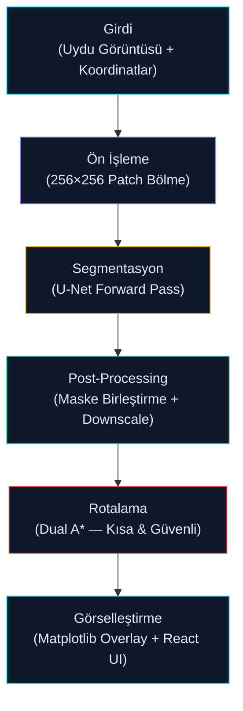

# NEBULA — Yapay Zeka Destekli Afet Müdahale Rotalama Sistemi

> Afet sonrası kentsel alanlarda, derin öğrenme tabanlı uydu görüntüsü segmentasyonu ve risk bilinçli A* yol bulma algoritması ile güvenli tahliye rotaları üreten uçtan uca bir karar destek sistemi.

### 🎬 [Demo Videosu (YouTube)](https://youtu.be/epfK9PN7kP0?si=YQjiUMozQwz_c0DN)
### 💼 [LinkedIn Paylaşımı](https://www.linkedin.com/posts/esra-musul-970789294_tua-hackathon-yapayzeka-share-7443830512860782592-kyh_?utm_source=share&utm_medium=member_desktop&rcm=ACoAAEdOXiQBD-hwT1s30l5PYbK_JuhteURJs-A)

---

## 1. Problem Tanımı

Büyük ölçekli afetlerden sonra mevcut yol ağları güvenilirliğini yitirir. Standart navigasyon araçları afet öncesi statik harita verilerine dayanır ve yeni oluşan enkazları, kapalı yolları veya hasar görmüş bölgeleri hesaba katamaz.

**Temel sorun:** Acil müdahale ekipleri, sahadaki güncel durumu yansıtan ve arazi riskini dikkate alan bir rotalama sistemine ihtiyaç duyar.

---

## 2. Önerilen Çözüm

NEBULA, üç aşamalı bir pipeline ile bu problemi çözer:

1. **Semantik Segmentasyon** — Eğitilmiş U-Net modeli, uydu/drone görüntüsündeki her pikseli 4 sınıftan birine atar.
2. **Maliyet Haritası (Cost Map)** — Segmentasyon maskesi, arazi sınıflarına göre ağırlıklandırılmış bir geçiş maliyeti haritasına dönüştürülür.
3. **Çift Modlu A\* Rotalama** — Eş zamanlı iki rota hesaplanır:
   - **En Kısa Yol** → Mesafeyi minimize eder, enkazı geçilebilir sayar.
   - **En Güvenli Yol** → Hasarlı bölgelerden kaçınır, riski minimize eder.

---

## 3. Sistem Mimarisi



---

## 4. İşlem Pipeline'ı



---

## 5. 🆚 Yenilik ve Katkı (Novelty & Contribution)

| Kriter | Geleneksel Yaklaşım | NEBULA |
|---|---|---|
| **Harita verisi** | Afet öncesi statik haritalar | Güncel görüntüden gerçek zamanlı segmentasyon |
| **Rotalama** | Tek modlu en kısa yol | Çift modlu: en kısa + en güvenli |
| **Risk değerlendirmesi** | Yok — tüm yollar eşit | Hasar sınıfına göre ağırlıklı maliyet haritası |
| **Hedef ortam** | Normal şehir koşulları | Afet sonrası kentsel arazi |
| **Veri bağımlılığı** | Önceden hazırlanmış GIS veritabanı | Herhangi bir havadan görüntü (uydu, drone) |

**Temel farklılaştırıcılar:**
- Yol ağını doğrudan girdi görüntüsünden türetir → önceden hazırlanmış harita veritabanından bağımsız.
- Çift maliyet haritası ile operatörlere hız-güvenlik ödünleşimi (trade-off) yapma imkânı sunar.
- Farklı görüntüleme kaynakları ve afet senaryolarına uyarlanabilir modüler tasarım.

---

## 6. 🧠 Model Detayları

### 6.1 Mimari

| Parametre | Değer |
|---|---|
| **Model** | U-Net (encoder-decoder, skip connections) |
| **Encoder** | ResNet34 (ImageNet pre-trained) |
| **Çıktı** | 5 sınıflı piksel bazlı sınıflandırma |
| **Kütüphane** | `segmentation-models-pytorch` |

### 6.2 Sınıf Tanımları

| ID | Etiket | Açıklama | A* Maliyeti (Kısa / Güvenli) |
|---|---|---|---|
| 0 | Arka Plan | Etiketlenmemiş arazi | 3.0 / 10.0 |
| 1 | `yol` | Sağlam, geçilebilir yol | 1.0 / 1.0 |
| 2 | `yıkık_yol` | Hasarlı / kısmen kapalı yol | 1.5 / 8.0 |
| 3 | `yıkık_bina` | Çökmüş bina / ağır enkaz | 2.0 / 8.0 |
| 4 | `saglam_bina` | Sağlam bina (geçilemez) | ∞ / ∞ |

### 6.3 Eğitim Yaklaşımı

- **Etiketleme:** LabelMe ile poligon tabanlı manuel etiketleme
- **Veri Seti:** 3 adet yüksek çözünürlüklü afet sonrası uydu görüntüsü
- **Patch Extraction:** 256×256 px kayan pencere (stride=256). Yalnızca etiketli piksel içeren parçalar eğitime alınır.
- **Eğitim Parametreleri:**

| Parametre | Değer |
|---|---|
| Optimizatör | Adam (lr = 1e-4) |
| Kayıp Fonksiyonu | Multiclass Dice Loss |
| Epoch | 30 |
| Batch Size | 16 |
| Cihaz | CUDA (GPU) / CPU fallback |

- **Çıktı:** `best_ultimate_model.pth`

### 6.4 Kısıtlamalar

> ⚠️ Bu bir prototip aşamasındaki modeldir.

- Eğitim seti küçüktür (3 görüntü). Daha büyük ve çeşitli veri setiyle doğruluk önemli ölçüde artacaktır.
- Etiketleme, hackathon zaman kısıtları altında gerçekleştirilmiştir; bazı sınıf sınırları kesin olmayabilir.
- Model, coğrafi olarak farklı afet senaryolarında henüz doğrulanmamıştır.

> 📄 Eğitim betiği: [`train_model.py`](train_model.py)

---

## 7. Teknoloji Yığını

### Ön Yüz (Frontend)
| Teknoloji | Kullanım Amacı |
|---|---|
| React + Vite | Bileşen tabanlı SPA, HMR desteği |
| Tailwind CSS | Koyu temalı kontrol paneli düzeni |
| Lucide-React | Arayüz ikon seti |

### Arka Yüz (Backend)
| Teknoloji | Kullanım Amacı |
|---|---|
| FastAPI | Asenkron HTTP API sunucusu |
| PyTorch | Model çıkarım runtime |
| OpenCV | Görüntü ön işleme, morfolojik operasyonlar |
| A* Algorithm | 8 yönlü, çapraz maliyet ağırlıklı yol bulma |

---

## 8. Kurulum ve Çalıştırma

### Gereksinimler
- Node.js ≥ 18 | Python ≥ 3.10
- `torch`, `segmentation-models-pytorch`, `fastapi`, `uvicorn`, `opencv-python`, `numpy`, `matplotlib`

### Başlatma
```bash
# Backend
pip install -r requirements.txt
python run_server.py          # → http://localhost:8000

# Frontend (ayrı terminal)
cd frontend
npm install
npm run dev                   # → http://localhost:5174
```

### Kullanım Adımları
1. Sol panelden uydu/drone görüntüsü yükleyin.
2. Görüntü üzerinde **başlangıç noktasını** (kurtarma ekibi konumu) tıklayın.
3. **Hedef noktasını** (tahliye hedefi) tıklayın.
4. **"YZ Analizini Başlat"** butonuna basın.
5. Sonuçları merkez panelde inceleyin:
   - 🟢 **Rota Planı** — Her iki yol orijinal görüntü üzerinde
   - 🔵 **YZ Hasar Haritası** — Segmentasyon maskesi
   - 🟡 **Çift Görünüm** — Yan yana karşılaştırma

---

## 9. Proje Yapısı

```
hackalton/
├── run_server.py              # FastAPI sunucusu
├── run_analysis.py            # Segmentasyon + A* rotalama pipeline
├── train_model.py             # Model eğitim betiği
├── best_ultimate_model.pth    # Eğitilmiş ağırlıklar
├── README.md
└── frontend/
    ├── src/
    │   ├── App.jsx            # Ana kontrol paneli bileşeni
    │   ├── main.jsx           # React giriş noktası
    │   └── index.css          # Global stiller & animasyonlar
    ├── tailwind.config.js
    ├── vite.config.js
    └── package.json
```

---

## 10. Gelecek Çalışmalar

- 📊 Eğitim veri setinin coğrafi çeşitliliğinin artırılması
- 👥 Çoklu kurtarma ekibi koordinasyonu (multi-agent routing)
- ⚡ Saha cihazları için model quantization (edge deployment)

---

*Yapay zeka ile daha güvenli bir gelecek inşa ediyoruz.*
